First make sure that you downloaded pygsp

```! pip install pygsp```


```python
import networkx as nx
import graphviz
import matplotlib.pyplot as plt
import seaborn as sns
import numpy as np
font = {'size'   : 10}
plt.rc('font', **font)
```

##  Example 1 - time series graph and the Fourier basis
Displaying the relation between the time-series Laplacian eigen-decomposition
and the Fourier basis


```python
N = 8
G = nx.Graph([(n,n+1) for n in range(N)])
pos = {n:(k*2,0.5) for k,n in enumerate(G.nodes())}

# plotting code
fig = plt.figure(figsize=(10,3))
plt.style.use('seaborn')
kw_nx = dict(node_color='Plum', node_size=800
             , alpha=1., linewidths=3
             , edge_color='Gray', edge_alpha=0.1
             , font_family='serif',font_weight=600
             , font_color='w', font_size=12
            )
ax = plt.gca()
nx.draw_networkx(G, pos = pos, **kw_nx)
ax.set_axis_off()
plt.show()
```


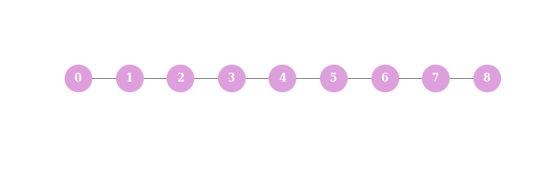


```python
L = nx.laplacian_matrix(G)

# plotting code
fig = plt.figure(figsize=(7,7))
ax=plt.gca()
sns.heatmap(L.toarray(),annot=True, fmt="d", cbar=False,cmap="BuPu")
ax.set_axis_off()
plt.show()
```


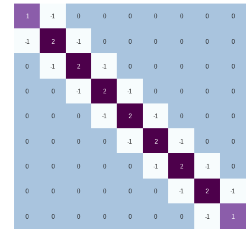


We see that the Laplacian has actually the form of the Discrete Cosine Transform (DCT), which is a variant of Fourier Transform. Thus the Eigenvalues have the following analytical structure
$$\chi_k:j\rightarrow\cos\Big(\big(j+\frac{1}{2}\big)\frac{k\pi}{N}\Big)$$


```python
N=9
lambd, chi = np.linalg.eigh(L.toarray())
x = np.linspace(0, N-1,100)
dct2_eigen = lambda l: np.sqrt(2/N) * np.cos(np.pi * l * (x+0.5) / N)

# plotting code
kw_plot_1 = dict(color='Gray',alpha=0.6)
kw_plot_2 = dict(marker='o'
                 , linestyle='None',alpha=1
                 , markerSize=11, markerFaceColor='Plum')
fig,axes = plt.subplots(nrows=N-2, ncols=1, figsize= (10,10), gridspec_kw=dict(hspace=0.5))
plt.style.use('seaborn-talk')
for k, eigvec in enumerate(chi.T):
    # scaling the first eigenvector to unit $\mathbf{1}$
    if k==0:
        axes[k].plot(x, np.ones_like(x),**kw_plot_1)
        axes[k].plot(np.ones_like(eigvec), **kw_plot_2)
        axes[k].set_title("Eigen values of time-domain laplacian vs. DCT-2 eigenvalues"
                          , fontsize=16, fontname='serif')
    else:
        axes[k].plot(x, dct2_eigen(k),**kw_plot_1)
        axes[k].plot(eigvec, **kw_plot_2)
    # TODO: bug with k=6 (!?)
    if k > 5:
        break
plt.show()
```


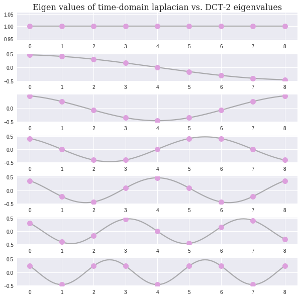


## Example 2 - Filtering on Minnesota road network


```python
from pygsp import graphs, filters
from pygsp import plotting
import matplotlib.pylab as plt

G = graphs.Minnesota()
G.compute_fourier_basis() # caching fourier basis

# plotting code
fig, axes = plt.subplots(1, 2, figsize=(13, 6))
plottingparam = dict(backend='matplotlib')
nx_plotting_param = dict(node_color='#1f77b4', node_size=10, with_labels=False
             , alpha=1, linewidths=2
             , edge_color='Gray', edge_alpha=0.1)
plotting.plot(G,ax = axes[0],**plottingparam)
_ = axes[0].set_title('Graph with geo-spatial context',fontsize=15)
axes[0].set_axis_off()
G_nx = nx.Graph([tuple(r) for r in np.array(G.get_edge_list()[:2]).T])
nx.draw_networkx(G_nx,ax =axes[1], **nx_plotting_param)
_ = axes[1].set_title('Graph spring layout',fontsize=15)
axes[1].set_axis_off()
fig.tight_layout()
plt.show()
```


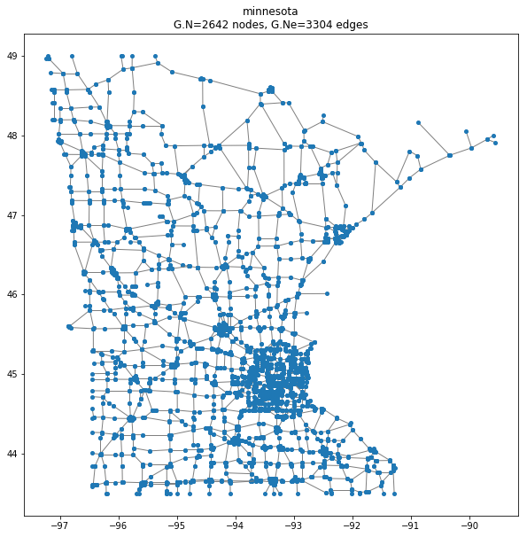


Lets create a noisy signal based on the distance from the dense part of Minnesota, specifically in $(-93.2, 45)$, somewhere next to Hennepin. We added a nonlinear cutoff for $s_{in}>2$ ,to further localize the signal.


```python
rs = np.random.RandomState()
s = np.zeros(G.N)
s += np.sqrt(np.sum((G.coords - np.array([-93.2, 45]))**2, axis=1))
s[s>2] = 3
s += rs.uniform(-1,1, size=G.N)

# plotting code
fig = plt.figure(figsize= (10,8))
plt.style.use('seaborn-deep')
ax = fig.gca()
plotting.plot_signal(G,s,ax=ax,**plottingparam)
plt.show()
```


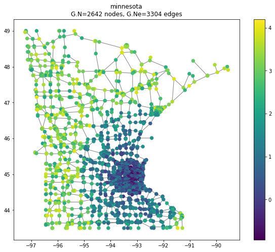


First lets design a heat filter and visualize it in the spectral domain.
The impulse response of this filter goes by

$$\hat{g}(x) = \exp \left( \frac{-\tau x}{\lambda_{\text{max}}} \right)$$

As you can tell, this is a Low Pass filter. We choose $\tau=50$ because we want to assure the removal of higher noise frequencies, and we assume that the spectral components that describe the clean signal have very small eigenvalues. 


```python
# First design filter as a heat fi
g = filters.Heat(G, tau=50)

# plotting code
fig, ax = plt.subplots(1,1)
g.plot(plot_eigenvalues=True, ax=ax)
ax.set_xlabel("eigen values $\lambda_l$", fontsize=15)
ax.set_ylabel("$\hat{h}(\lambda_l)$", fontsize=15)
ax.set_title('Filter frequency response',fontsize=15)
plt.show()
```


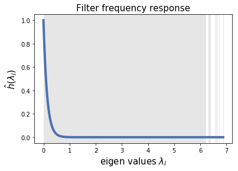


```python
s_out = g.filter(s, method='exact') # exact uses GFT. Chebychev is also available

# plotting code
fig, axes = plt.subplots(1, 2, figsize=(13, 6))
axes[0]`
plotting.plot_signal(G, s, ax=axes[0], **plottingparam)
_ = axes[0].set_title('Noisy signal before filtering',fontsize=15)
axes[0].set_axis_off()
plotting.plot_signal(G, s_out, ax=axes[1], **plottingparam)
_ = axes[1].set_title('Filtered signal',fontsize=15)
axes[1].set_axis_off()
fig.tight_layout()
plt.show()
```


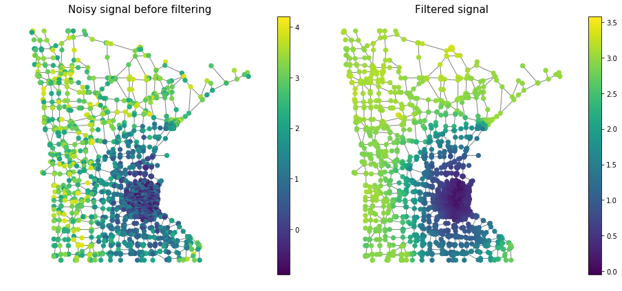


## Draft


```python
# First design filter as a heat fi
g = filters.MexicanHat(G, Nf=6, lpfactor=100)
fig, ax = plt.subplots(1,1, figsize=(8,6))
g.plot(plot_eigenvalues=True, ax=ax)
ax.set_xlabel("eigen values $\lambda_l$", fontsize=15)
ax.set_ylabel("$\hat{h}(\lambda_l)$", fontsize=15)
ax.set_title('Filter frequency response',fontsize=15)
plt.show()
```


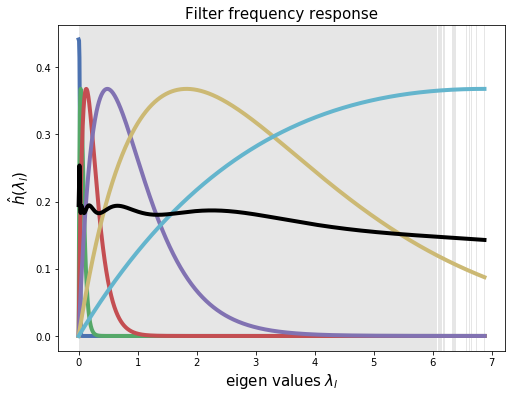


```python
s_out = g.filter(s, method='exact') # exact uses GFT. Chebychev is also available
```


```python
fig, axes = plt.subplots(1, 2, figsize=(13, 6))
axes[0]
plotting.plot_signal(G, s, ax=axes[0], **plottingparam)
_ = axes[0].set_title('Noisy signal before filtering',fontsize=15)
axes[0].set_axis_off()
plotting.plot_signal(G, s_out[:,0], ax=axes[1], **plottingparam)
_ = axes[1].set_title('Filtered signal',fontsize=15)
axes[1].set_axis_off()
fig.tight_layout()
plt.show()
```


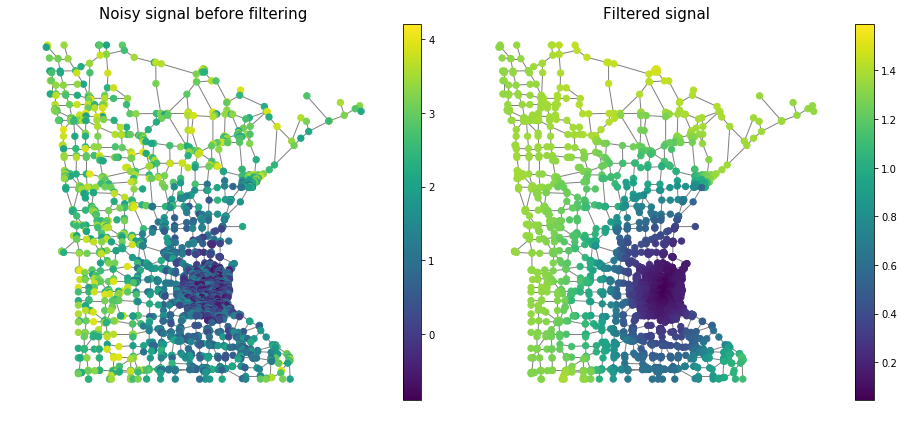


```python
fig, axes = plt.subplots(1, 2, figsize=(13, 6))
axes[0]
plotting.plot_signal(G, s, ax=axes[0], **plottingparam)
_ = axes[0].set_title('Noisy signal before filtering',fontsize=15)
axes[0].set_axis_off()
plotting.plot_signal(G, s_out[:,1], ax=axes[1], **plottingparam)
_ = axes[1].set_title('Filtered signal',fontsize=15)
axes[1].set_axis_off()
fig.tight_layout()
plt.show()
```


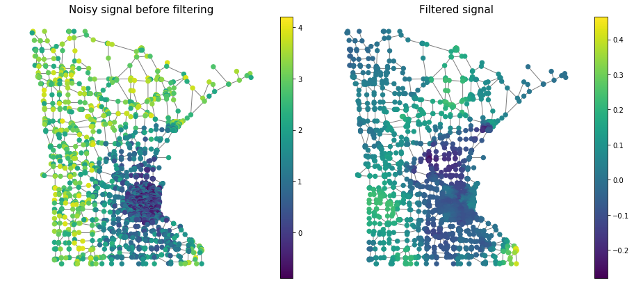


```python
fig, axes = plt.subplots(1, 2, figsize=(13, 6))
axes[0]
plotting.plot_signal(G, s, ax=axes[0], **plottingparam)
_ = axes[0].set_title('Noisy signal before filtering',fontsize=15)
axes[0].set_axis_off()
plotting.plot_signal(G, s_out[:,5], ax=axes[1], **plottingparam)
_ = axes[1].set_title('Filtered signal',fontsize=15)
axes[1].set_axis_off()
fig.tight_layout()
plt.show()
```


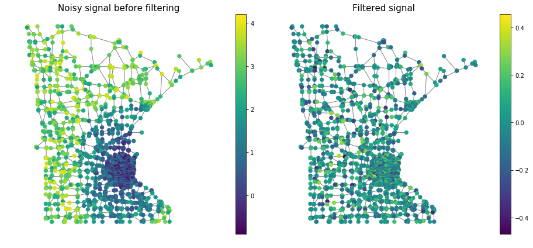


```python
fig = plt.figure(figsize= (10,8))
s = G.U[:,2]
plt.style.use('seaborn-paper')
ax = fig.gca()
plotting.plot_signal(G,s,ax=ax,**plottingparam,)
plt.show()
```

Now lets design the new signal as a combination of some noise, and the 1,3 and 7 spectral components


```python
N = G.coords.shape[0]
s_hat_in = G.U.dot(np.ones((N,1)))
filt_fun = lambda e_val: np.exp(-2*e_val)
# inverse graph fourier transform on s_hat_in
s_hat_out = s_hat_in.T.dot((G.U.T * filt_fun(G.e)))

# sigma = 0.2
# coeff = np.array([1,3,2,5])
# s_hat_out = G.U[:,range(0,8,2)].dot(coeff.T) + sigma * np.random.randn(G.U.shape[0])
```


```python
fig = plt.figure(figsize= (10,8))
ax = fig.gca()
plotting.plot_signal(G,s_hat_out,**plottingparam,ax=ax)
plt.show()
```


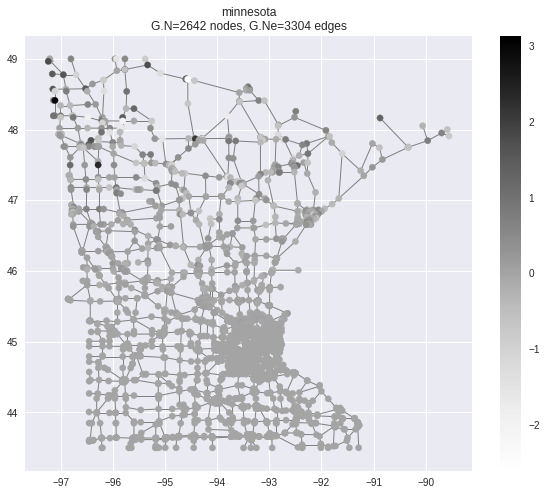


Let's first late a look on the spectrum.


```python
sigma = 0.2
coeff = np.array([1,3,2,5])
s_hat_out = G.U[:,range(0,8,2)].dot(coeff.T) + sigma * np.random.randn(G.U.shape[0])
```

The [Fiedler vector](https://en.wikipedia.org/wiki/Algebraic_connectivity) enables to partition the graph, and thus we expect one of the prime spectral component's to segregate the dense part from the rest of the map. 
Let's filter the signal to it's low frequencies


```python
s_in = s_hat_out
s_hat_in = s_in.dot(G.U).T
s_filt = pygsp.filters.cheby_rect(G, [0.0015,0.0025],s_hat_in,order=150)
# s_filt = pygsp.filters.MexicanHat(G, [0.0015,0.0025],s_hat_in,order=150)
# s_filt = g.filter(s_in.T)
```


```python
fig = plt.figure(figsize= (8,6))
ax = fig.gca()
G.plot_signal(s_filt[:,5], ax=ax, **plottingparam)
plt.show()
```


    ---------------------------------------------------------------------------

    KeyboardInterrupt                         Traceback (most recent call last)

    <ipython-input-384-ae2466991ad8> in <module>()
          2 ax = fig.gca()
          3 G.plot_signal(s_filt[:,5], ax=ax, **plottingparam)
    ----> 4 plt.show()
    

    ~/anaconda3/lib/python3.6/site-packages/matplotlib/pyplot.py in show(*args, **kw)
        251     """
        252     global _show
    --> 253     return _show(*args, **kw)
        254 
        255 


    ~/anaconda3/lib/python3.6/site-packages/ipykernel/pylab/backend_inline.py in show(close, block)
         34     try:
         35         for figure_manager in Gcf.get_all_fig_managers():
    ---> 36             display(figure_manager.canvas.figure)
         37     finally:
         38         show._to_draw = []


    ~/anaconda3/lib/python3.6/site-packages/IPython/core/display.py in display(include, exclude, metadata, transient, display_id, *objs, **kwargs)
        300             publish_display_data(data=obj, metadata=metadata, **kwargs)
        301         else:
    --> 302             format_dict, md_dict = format(obj, include=include, exclude=exclude)
        303             if not format_dict:
        304                 # nothing to display (e.g. _ipython_display_ took over)


    ~/anaconda3/lib/python3.6/site-packages/IPython/core/formatters.py in format(self, obj, include, exclude)
        169             md = None
        170             try:
    --> 171                 data = formatter(obj)
        172             except:
        173                 # FIXME: log the exception


    <decorator-gen-9> in __call__(self, obj)


    ~/anaconda3/lib/python3.6/site-packages/IPython/core/formatters.py in catch_format_error(method, self, *args, **kwargs)
        213     """show traceback on failed format call"""
        214     try:
    --> 215         r = method(self, *args, **kwargs)
        216     except NotImplementedError:
        217         # don't warn on NotImplementedErrors


    ~/anaconda3/lib/python3.6/site-packages/IPython/core/formatters.py in __call__(self, obj)
        330                 pass
        331             else:
    --> 332                 return printer(obj)
        333             # Finally look for special method names
        334             method = get_real_method(obj, self.print_method)


    ~/anaconda3/lib/python3.6/site-packages/IPython/core/pylabtools.py in <lambda>(fig)
        235 
        236     if 'png' in formats:
    --> 237         png_formatter.for_type(Figure, lambda fig: print_figure(fig, 'png', **kwargs))
        238     if 'retina' in formats or 'png2x' in formats:
        239         png_formatter.for_type(Figure, lambda fig: retina_figure(fig, **kwargs))


    ~/anaconda3/lib/python3.6/site-packages/IPython/core/pylabtools.py in print_figure(fig, fmt, bbox_inches, **kwargs)
        119 
        120     bytes_io = BytesIO()
    --> 121     fig.canvas.print_figure(bytes_io, **kw)
        122     data = bytes_io.getvalue()
        123     if fmt == 'svg':


    ~/anaconda3/lib/python3.6/site-packages/matplotlib/backend_bases.py in print_figure(self, filename, dpi, facecolor, edgecolor, orientation, format, **kwargs)
       2198                     orientation=orientation,
       2199                     dryrun=True,
    -> 2200                     **kwargs)
       2201                 renderer = self.figure._cachedRenderer
       2202                 bbox_inches = self.figure.get_tightbbox(renderer)


    ~/anaconda3/lib/python3.6/site-packages/matplotlib/backends/backend_agg.py in print_png(self, filename_or_obj, *args, **kwargs)
        543 
        544     def print_png(self, filename_or_obj, *args, **kwargs):
    --> 545         FigureCanvasAgg.draw(self)
        546         renderer = self.get_renderer()
        547         original_dpi = renderer.dpi


    ~/anaconda3/lib/python3.6/site-packages/matplotlib/backends/backend_agg.py in draw(self)
        462 
        463         try:
    --> 464             self.figure.draw(self.renderer)
        465         finally:
        466             RendererAgg.lock.release()


    ~/anaconda3/lib/python3.6/site-packages/matplotlib/artist.py in draw_wrapper(artist, renderer, *args, **kwargs)
         61     def draw_wrapper(artist, renderer, *args, **kwargs):
         62         before(artist, renderer)
    ---> 63         draw(artist, renderer, *args, **kwargs)
         64         after(artist, renderer)
         65 


    ~/anaconda3/lib/python3.6/site-packages/matplotlib/figure.py in draw(self, renderer)
       1142 
       1143             mimage._draw_list_compositing_images(
    -> 1144                 renderer, self, dsu, self.suppressComposite)
       1145 
       1146             renderer.close_group('figure')


    ~/anaconda3/lib/python3.6/site-packages/matplotlib/image.py in _draw_list_compositing_images(renderer, parent, dsu, suppress_composite)
        137     if not_composite or not has_images:
        138         for zorder, a in dsu:
    --> 139             a.draw(renderer)
        140     else:
        141         # Composite any adjacent images together


    ~/anaconda3/lib/python3.6/site-packages/matplotlib/artist.py in draw_wrapper(artist, renderer, *args, **kwargs)
         61     def draw_wrapper(artist, renderer, *args, **kwargs):
         62         before(artist, renderer)
    ---> 63         draw(artist, renderer, *args, **kwargs)
         64         after(artist, renderer)
         65 


    ~/anaconda3/lib/python3.6/site-packages/matplotlib/axes/_base.py in draw(self, renderer, inframe)
       2424             renderer.stop_rasterizing()
       2425 
    -> 2426         mimage._draw_list_compositing_images(renderer, self, dsu)
       2427 
       2428         renderer.close_group('axes')


    ~/anaconda3/lib/python3.6/site-packages/matplotlib/image.py in _draw_list_compositing_images(renderer, parent, dsu, suppress_composite)
        137     if not_composite or not has_images:
        138         for zorder, a in dsu:
    --> 139             a.draw(renderer)
        140     else:
        141         # Composite any adjacent images together


    ~/anaconda3/lib/python3.6/site-packages/matplotlib/artist.py in draw_wrapper(artist, renderer, *args, **kwargs)
         61     def draw_wrapper(artist, renderer, *args, **kwargs):
         62         before(artist, renderer)
    ---> 63         draw(artist, renderer, *args, **kwargs)
         64         after(artist, renderer)
         65 


    ~/anaconda3/lib/python3.6/site-packages/matplotlib/lines.py in draw(self, renderer)
        820                     gc.set_sketch_params(*self.get_sketch_params())
        821 
    --> 822                 drawFunc(renderer, gc, tpath, affine.frozen())
        823                 gc.restore()
        824 


    ~/anaconda3/lib/python3.6/site-packages/matplotlib/lines.py in _draw_lines(self, renderer, gc, path, trans)
       1265 
       1266     def _draw_lines(self, renderer, gc, path, trans):
    -> 1267         self._lineFunc(renderer, gc, path, trans)
       1268 
       1269     def _draw_steps_pre(self, renderer, gc, path, trans):


    ~/anaconda3/lib/python3.6/site-packages/matplotlib/lines.py in _draw_solid(self, renderer, gc, path, trans)
       1291         gc.set_linestyle('solid')
       1292         gc.set_dashes(self._dashOffset, self._dashSeq)
    -> 1293         renderer.draw_path(gc, path, trans)
       1294 
       1295     def _draw_dashed(self, renderer, gc, path, trans):


    ~/anaconda3/lib/python3.6/site-packages/matplotlib/backends/backend_agg.py in draw_path(self, gc, path, transform, rgbFace)
        164                 self._renderer.draw_path(gc, p, transform, rgbFace)
        165         else:
    --> 166             self._renderer.draw_path(gc, path, transform, rgbFace)
        167 
        168     def draw_mathtext(self, gc, x, y, s, prop, angle):


    KeyboardInterrupt: 


```python
fig = plt.figure(figsize= (10,8))
ax = fig.gca()
# plotting.plot_signal(G,G.U[:,2],**plottingparam,ax=ax)
plotting.plot_signal(G,s_filt,**plottingparam,ax=ax)
plt.show()

# std = 0.0001
# filt_fun = lambda e_val: np.exp( (e_val - G.e[2])**2/std)
# # inverse graph fourier transform on s_hat_in
# s_hat_out = s_hat_in.T.dot((G.U.T * filt_fun(G.e)))
```


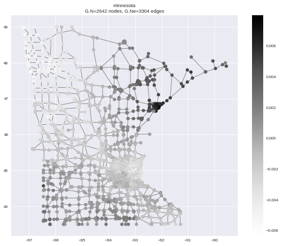

